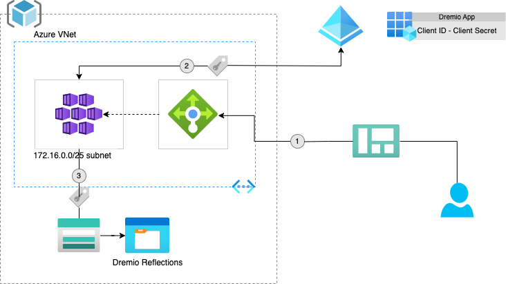
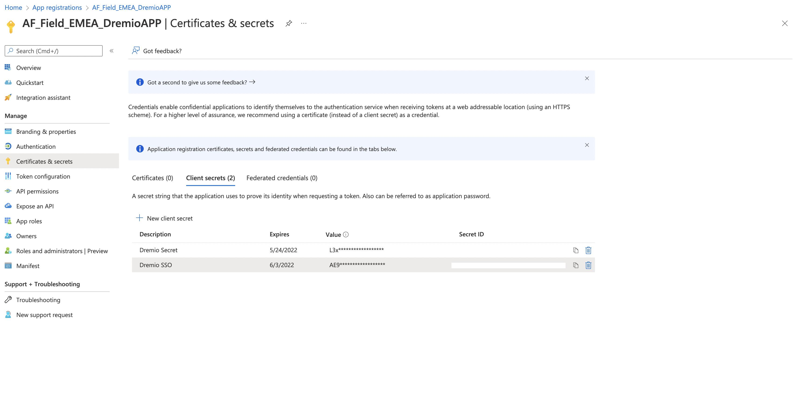
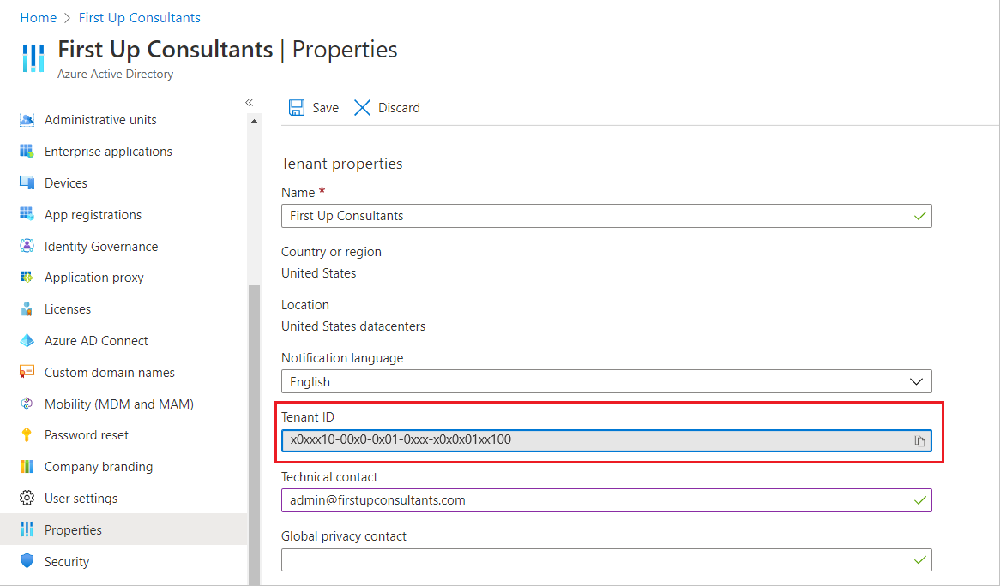

Dremio Deployment Tool
====

The unofficial script for deploying Dremio in IaaS environments. This script enables administrators to deploy Dremio securely and efficiently to their cloud subscription. Dremio deployment tool fully deploys the infrastructure (if required) and Dremio to cloud-native Kubernetes. 

The key features of this tool are:

- **Cloud Support**: Only currently supporting Azure, although this might change in due course to include other vendors.
- **Effortless Deployment**: Deploys Dremio to Cloud-native Kubernetes with limited effort required from administrators.
- **Flexible Configuration**: Enables administrators to interact with the script at different stages, depending on their environment setup.

By default, this will deploy an AKS cluster comprising 1 coordinator, 3 executor nodes (with the ability to scale up to 5), and 3 zookeeper nodes, where the instance types are Standard_D8_v4, Standard_D8_v4 and Standard_D2_v2 respectively - instance types can be changed by updating the variables.tf file in this directory. The quantities of nodes can be changed by setting COORDINATOR_NODES, EXECUTOR_NODES, ZOOKEEPER_NODES respectively variables inside dremio.conf.


## Pre-requisite

- Azure Subscription with owner privileges
- Create an Azure storage account (see [Create a storage account](https://docs.microsoft.com/en-us/azure/storage/common/storage-account-create?tabs=azure-portal) for details) - this is required for Terraform state backup.
- Create an Azure Enterprise Application (EA) with:
  <details>
    <summary markdown="span">API Permissions set for User Impersonation on Azure Storage</summary>
    <ol>
        <li> Inside the Enterprise Application select <b>API Permissions</b></li>
        <li>Select <b>Add Permission</b></li>
        <li>Search for and click <b>Azure Storage</b></li>
        <li>Tick the checkbox at the side of user_impersonation and select add permissions.</li>
    </ol>
    <br/>
    
  </details>
- Download Dremio Cloud tools from [dremio-cloud-tools](https://github.com/dremio/dremio-cloud-tools)

## Software requirements
- [Helm](https://helm.sh/)
- [Terraform](https://www.terraform.io/downloads)
- [Azure CLI](https://docs.microsoft.com/en-us/cli/azure/install-azure-cli)
- [Kubernetes or KubeCTL](https://kubernetes.io/docs/tasks/tools/)

The setup for Dremio can be performed using <b>User</b> who has <i>Owner</i> permissions in your Azure subscription, or alternatively an <b>Enterprise Application (EA)</b> that has the following permissions.

## Permissions
> If you are using an Enterprise Application and it's Service Principal then you will need to assign the required Azure permissions below. Otherwise, skip this section.

- Assign Contributor role to the EA on your subscription
- Create custom role for Dremio using create_custom_dremio_role.sh and assign to the Enterprise Application

## Complete install
This script has flexible configuration, that is, it allows system administrators to interact with it at any stage of the process for deploying Dremio. The setup guide below is for a full deployment, if you want to deploy Dremio inside your own Azure Infrastructure then please see [Deploy with exiting infrastructure](#partial-install) for details.
<br/>
1. Assign ```Storage Blob Data Owner``` to your User on the Storage account created in [Pre-requisite](#pre-requisite), alternatively if you are using an Enterprise Application then you will need to assign it this.
2. Create a copy of dremio.config and rename it as dremio.local.config, and populate it with relevant values for the following variables.

| Variable  	| Description  | Required 	|
|---	|:---	|	---|
| DOCKER_USER 	| Docker Username used to access Dremio on Dockerhub 	| Yes 	|
| DOCKER_PASSWD 	| Docker Password used to access Dremio on Dockerhub 	| Yes 	|
| DOCKER_EMAIL 	| Docker Email used to access Dremio on Dockerhub 	| Yes 	|
| DREMIO_TF_DIR 	| Directory where this terraform folder is located 	| Yes 	|
| DREMIO_CONF 	| Directory where the Dremio Helm chart is located - downloaded from [dremio-cloud-tools](https://github.com/dremio/dremio-cloud-tools). Within the dremio-cloud-tools/charts/ sub-folder.	| Yes 	|
| TLS_PRIVATE_KEY_PATH 	| Location of the private key (only required when enabling TLS) 	| No 	|
| TLS_CERT_PATH 	| Location of the TLS cert (only required when enabling TLS) 	| No 	|
| AAD_CLIENT_ID 	| Azure Enterprise Application Client ID (see [Find My Client ID](#find-my-azure-client-id) for details)	| Yes 	|
| AAD_SECRET 	| Azure Enterprise Application Secret (see [Create a secret](#create-a-secret) for details) 	| Yes 	|
| AAD_APP_NAME 	| Azure Enterprise Application Name 	| Yes 	|
| AAD_TENANT_ID 	| Azure Tenant for the Enterprise Application (see [Locate my Tenant ID](#locate-my-tenant-id) for details) 	| Yes 	|
| AZURE_SUB_ID 	| Azure Subscription ID (see [Locate my Subscriptions ID](#locate-my-subscription-id) for details)	| Yes 	|
| SSH_KEY 	| SSH Key for Dremio instances - please see x for 	| Yes 	|
| EXECUTOR_MEMORY 	| Memory allocated for the executor nodes (default is 4GB) 	| No 	|
| EXECUTOR_CPU 	| CPU allocated for the executor nodes (default is 2) 	| No 	|
| EXECUTOR_NODES 	| Quantity of Executor nodes (default is 3)	| No 	|
| COORDINATOR_MEMORY 	| Memory allocated for the coordinator nodes (default is 4GB) 	| No 	|
| COORDINATOR_CPU 	| CPU allocated for the coordinator nodes (default is 2) 	| No 	|
| COORDINATOR_NODES	| Quantity of Coordinator  nodes (default is 1) 	| No 	|
| ZOOKEEPER_MEMORY 	| Memory allocated for the zookeeper nodes (default is 1GB) 	| No 	|
| ZOOKEEPER_CPU 	| CPU allocated for the zookeeper nodes (default is 0.5) 	| No 	|
| ZOOKEEPER_NODES	| Quantity of Zookeeper  nodes (default is 3)  	| No 	|
| AZURE_SP 	| Determines if we are using user or Azure Service Principal to configure Dremio (default is false) 	| No 	|
| REDIRECT_URL 	| Re-direct URL for SSO e.g., ```https://{HOSTNAME}/sso``` (see [Set up Redirect URL](#set-up-redirect-url) for details on how to set this up)	| Yes 	|
| TF_STORAGE_ACCOUNT 	| Name of the storage account that was created in [Pre-Requisite](#pre-requisite)	| Yes 	|
| ENV_PREFIX 	| Prefix for the Dremio deployment. This will be the prefix given to all resources deployed inside your Azure subscription associated with Dremio.	| No 	|
| DREMIO_STORAGE_ACCOUNT 	| Name of the storage account for Dremio distributed storage (default value is dremiostorageaccount)	| No 	|
| AZURE_RESOURCE_GROUP 	| Name of the resource group for Dremio to be deployed within. If this is not set and the {$ENV_PREFIX} variable has been set then it will be deployed into a resource group called <b>{ENVIRONMENT_PREFIX}_rg</b>, if not then it will be called <b>DREMIO_PROD_rg</b>. If this value is set and the resource group already exists then Dremio will deploy into this resource group (see [Deploy with exiting infrastructure](#partial-install) for details).	| No 	|
| DREMIO_IMG 	| Dremio Docker Image that will be installed this can be dremio/dremio-oss for CE deployments or dremio/dremio-ee for EE deployments. Note EE deployments required Dockerhub access. So you will need to speak to your Account Executive or Solutions Architect to set this up.	(Default value is dremio/dremio-oss)| No 	|
| DREMIO_VERSION 	| Version of Dremio to be deployed inside your environment (default value is latest).	| No 	|

3. Create Enterprise Application in Azure and ensure that the Redirect URL of your App Registration matches the config property ```REDIRECT_URL``` inside dremio.config.
4. Deploy Azure Infrastructure and Dremio using ```sh ./deploy_dremio.sh```
5. Confirm Deployment was successful using ```kubectl get pods```
6. Check Dremio service is running using ```kubectl get svc``` and confirm it is running on your public IP address or a valid public IP address dependent on if the variable has been set.
7. Add the PIP to your DNS Zone
8. Finally, try to access Dremio using ```http(s)://{HOSTNAME}```.

##Partial Install
In order to partially install Dremio, this is typically for environments whereby AKS or some elements of the Azure Infrastructure has already been deployed. So far, this script only supports if you have provided your own resource group or AKS cluster. If this is applicable to your requirements then please follow the guide below.
<br />
<details>
  <summary markdown="span">Deploy Dremio inside your own Azure Resource Group</summary>
  <ol>
    <li>Locate the resource group that you want to deploy Dremio within and ensure that your user has contibutor privileges on this resource group</li>
    <li>Change the variable <b>AZURE_RESOURCE_GROUP</b> in dremio.config to your resource group.</li>
    <li>Input respective values for the following variables inside dremio.config as well as the required variables inside  <b>AZURE_RESOURCE_GROUP</b>, <b>STORAGE_ACCOUNT</b>, <b>DREMIO_CONTAINER</b>, <b>ENV_PREFIX</b></li>
    <li>Execute deploy_dremio.sh</li>
  </ol>
  This will begin installation of the AKS Cluster and required resources for Dremio in your chosen resource group.
</details>
<br/>
<details>
  <summary markdown="span">Deploy Dremio inside your own AKS Cluster</summary>
  Deploying inside your own environment has some requirements. These requirements are:
  <ol>
    <li><b>Owner</b> Privileges of the subscription</li>
    <li>Assign Network Contributor role for your Enterprise Application on your Node Resource Group. The Node Resource Group is typically prefixed inside Azure with MC_.</li>
    <li>Create Azure Storage account that is accessible from the Enterprise Application (see <a href="#pre-requisite">Pre-requisite</a> for details).</li>
    <li>Create and configure an Azure Public IP Address and Associated DNS Zone - required for SSO.</li>
  </ol>
  Once you have satisfied the requirements above, then you can follow the steps below to deploy Dremio inside your own environment. Note that when we decommission/destroy the Dremio infrastructure this resource group will be protected and thus not deleted as part of the process.
  <ol>
    <li>Input respective values for the following variables inside dremio.config <b>CLUSTER_NAME</b>, <b>AKS_RESOURCE_GROUP</b>, <b>NODE_RESOURCE_GROUP</b>, <b>PIP_IP_ADDRESS</b>, <b>STORAGE_ACCOUNT</b> and <b>DREMIO_CONTAINER</b></li>
    <li>Execute deploy_dremio.sh and skip the first step by typing in <br>3</b> when prompted.</li>
  </ol>
  This will deploy Dremio to your own Azure environment.
</details>

Appendix
====

### Find my Azure client id
<details>
  <summary markdown="span">To find your Enterprise application Client ID please see below.</summary>
    <br/>
    <ol>
        <li> Select the Enterprise Application name using Home->App Registrations</li>
        <li> In the overview section you will see <b>Application (client) ID</b>. This is the client id required by the Dremio deployer.</li>
        <li> Copy this ID using the <b>Copy to clipboard</b> icon on the right of the id and paste this in your dremio.config file under the property <b>AAD_CLIENT_ID</b>.</li>
    </ol>
</details>

### Create a Secret
<details>
  <summary markdown="span">To create a secret for your Enterprise application please see below.</summary>
    <br/>
    <ol>
        <li> Select the Enterprise Application name using Home->App Registrations</li>
        <li> In the menu on the left-hand side, select <b>Certificates & secrets</b></li>
        <li> Click the + icon next to <b>New client secret</b>. This will open up a menu whereby you can set the secret name and expiration time.</li>
        <li> Once you have input your details then just select <b>Add</b>. This will create a secret for your Enterprise Application and add it to the list of secrets see below.</li>
        <li> Locate the new secret and select the <b>Copy to clipboard</b> icon to the right of the Value field in the table. <i>Note this value will only be available for this session, so make sure you store it in a safe location.</i></li>
        <li> Paste it in your dremio.config file under the property <b>AAD_SECRET</b></li>
    </ol>
    <br/>
    
</details>

### Locate my tenant id
<details>
  <summary markdown="span">To find your Tenant ID please see below.</summary>
    <br/>
    <ol>
        <li> Select <b>Azure Active Directory</b> under Azure services</li>
        <li> Select <b>Properties</b></li>
        <li> Then, scroll down to the <b>Tenant ID</b> field, and select the <b>Copy to clipboard</b> icon to the right of the value in the box</li>
        <li> Paste this in your dremio.config file under the property <b>AAD_TENANT_ID</b>.</li>
    </ol>
    <br/>
    
</details>

### Locate my subscription id
<details>
  <summary markdown="span">To find your Subscription ID please see below.</summary>
    <br/>
    <ol>
        <li> Navigate to Home by clicking the <b>Microsoft Azure</b> icon at the top left-hand side of the screen</li>
        <li> Select <b>Subscriptions</b> under Azure Services. Alternatively, search for <b>Subscriptions</b> in the search bar at the top of the screen.</li>
        <li> Select the subscription that you are planning to deploy Dremio to</li>
        <li> Under <b>Essentials</b> you will see your Subscription ID. Select the <b>Copy to clipboard</b> icon and paste it in your dremio.config file under the property <b>AZURE_SUB_ID</b>.</li>
    </ol>
</details>

### Set up Redirect URL
<details>
  <summary markdown="span">To setup your Enterprise Application Redirect URL please see below.</summary>
    <br/>
    <ol>
        <li> Select the Enterprise Application name using Home->App Registrations</li>
        <li> In the menu on the left-hand side, select <b></b>Authentication</b>.</li>
        <li> Navigate to the box with the title <b>Web</b> and select <b>Add URI</b></li>
        <li> Input the URL that you want to use for your Dremio instance, followed by /sso e.g., <i>https://{HOSTNAME}/sso</i>.</li>
        <li> Select save. Now your Redirect URL should be setup for Dremio to authenticate your users using SSO.</li>
    </ol>
</details>