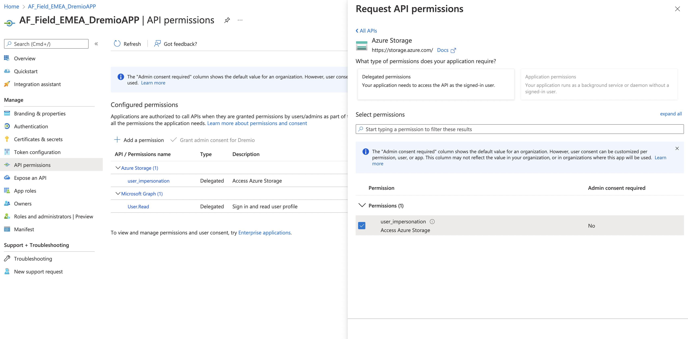

Dremio Deployment Tool
====

The unofficial script for deploying Dremio in IaaS environments. This script enables administrators to deploy Dremio securely and efficiently to their cloud subscription. Dremio deployment tool fully deploys the infrastructure (if required) and Dremio to cloud-native Kubernetes. 

The key features of this tool are:

- **Cloud Support**: Only currently supporting Azure, although this might change in due course to include other vendors.
- **Effortless Deployment**: Deploys Dremio to Cloud-native Kubernetes with limited effort required from administrators.
- **Flexible Configuration**: Enables administrators to interact with the script at different stages, depending on their environment setup.

By default, this will deploy an AKS cluster comprising 1 coordinator, 1 executor (with the ability to scale up to 5), and 1 zookeeper node, where the instance types are Standard_D8_v4, Standard_D8_v4 and Standard_D2_v2 respectively - instance types and quantities can be changed by updating the variables.tf file in this directory. 

## Pre-requisites

- Azure Subscription with owner privileges
- Create an Azure Enterprise Application with:
  <details>
    <summary markdown="span">API Permissions set for User Impersonation on Azure Storage</summary>
    <ol>
        <li> Inside the Enterprise Application select <b>API Permissions</b></li>
        <li>Select <b>Add Permission</b></li>
        <li>Search for and click <b>Azure Storage</b></li>
        <li>Tick the checkbox at the side of user_impersonation and select add permissions.</li>
    </ol>
    <br/>
    
  </details>
- Create an Azure storage account - this is required for Terraform state backup
- Download Dremio Cloud tools from [dremio-cloud-tools](https://github.com/dremio/dremio-cloud-tools)

## Software requirements
- [Helm](https://helm.sh/)
- [Terraform](https://www.terraform.io/downloads)
- [Azure CLI](https://docs.microsoft.com/en-us/cli/azure/install-azure-cli)
- [Kubernetes or KubeCTL](https://kubernetes.io/docs/tasks/tools/)

The setup for Dremio can be performed using <b>User</b> who has <i>Owner</i> permissions in your Azure subscription, or alternatively an <b>Enterprise Application (EA)</b> that has the following permissions.

## Permissions
> If you are using an Enterprise Application and it's Service Principal then you will need to assign the required Azure permissions below.

- Assign Contributor role to the EA on your subscription
- Create custom role for Dremio using create_custom_dremio_role.sh and assign to the Enterprise Application

## Setup
1. Assign ```Storage Blob Data Owner``` to your User on the Storage account created in [Pre-Requisites](#pre-requisites), alternatively if you are using an Enterprise Application then you will need to assign ```Storage Blob Data Owner``` to your EA on the ```dremiotfstorageaccount```.
2. Update dremio.config with relevant values for the following variables.

| Variable  	| Description  | Required 	|
|---	|:---	|	---|
| DOCKER_USER 	| Docker Username used to access Dremio on Dockerhub 	| Yes 	|
| DOCKER_PASSWD 	| Docker Password used to access Dremio on Dockerhub 	| Yes 	|
| DOCKER_EMAIL 	| Docker Email used to access Dremio on Dockerhub 	| Yes 	|
| DREMIO_TF_DIR 	| Directory where the terraform script is located 	| Yes 	|
| DREMIO_CONF 	| Directory where the Dremio Helm chart is located - downloaded from [dremio-cloud-tools](https://github.com/dremio/dremio-cloud-tools). Within dremio-cloud-tools/charts/	| Yes 	|
| TLS_PRIVATE_KEY_PATH 	| Location of the private key (only required when enabling TLS) 	| No 	|
| TLS_CERT_PATH 	| Location of the TLS cert (only required when enabling TLS) 	| No 	|
| AAD_CLIENT_ID 	| Azure Enterprise Application Client ID 	| Yes 	|
| AAD_SECRET 	| Azure Enterprise Application Secret 	| Yes 	|
| AAD_APP_NAME 	| Azure Enterprise Application Name 	| Yes 	|
| AAD_TENANT_ID 	| Azure Tenant for the Enterprise Application 	| Yes 	|
| AZURE_SUB_ID 	| Azure Subscription ID 	| Yes 	|
| SSH_KEY 	| SSH Key for Dremio instances - please see x for 	| Yes 	|
| EXECUTOR_MEMORY 	| Memory allocated for the executor nodes (default is 4GB) 	| No 	|
| EXECUTOR_CPU 	| CPU allocated for the executor nodes (default is 2) 	| No 	|
| COORDINATOR_MEMORY 	| Memory allocated for the coordinator nodes (default is 4GB) 	| No 	|
| COORDINATOR_CPU 	| CPU allocated for the coordinator nodes (default is 2) 	| No 	|
| ZOOKEEPER_MEMORY 	| Memory allocated for the zookeeper nodes (default is 1GB) 	| No 	|
| ZOOKEEPER_CPU 	| CPU allocated for the zookeeper nodes (default is 0.5) 	| No 	|
| AZURE_SP 	| Determines if we are using user or Azure Service Principal to configure Dremio (default is false) 	| No 	|
| REDIRECT_URL 	| Re-direct URL for SSO e.g., ```https://{HOSTNAME}:9047/sso``` 	| Yes 	|

3. Create Enterprise Application in Azure and ensure that the Redirect URL of your App Registration matches the config property ```REDIRECT_URL``` inside dremio.config.
4. Deploy Azure Infrastructure and Dremio using ```sh ./deploy_dremio.sh```
5. Confirm Deployment was successful using ```kubectl get pods```
6. Check Dremio service is running using ```kubectl get svc``` and confirm it is running on your public IP address or a valid public IP address dependent on if the variable has been set.
7. Add the PIP to your DNS Zone
8. Finally, try to access Dremio using ```http(s)://{HOSTNAME}:9047```